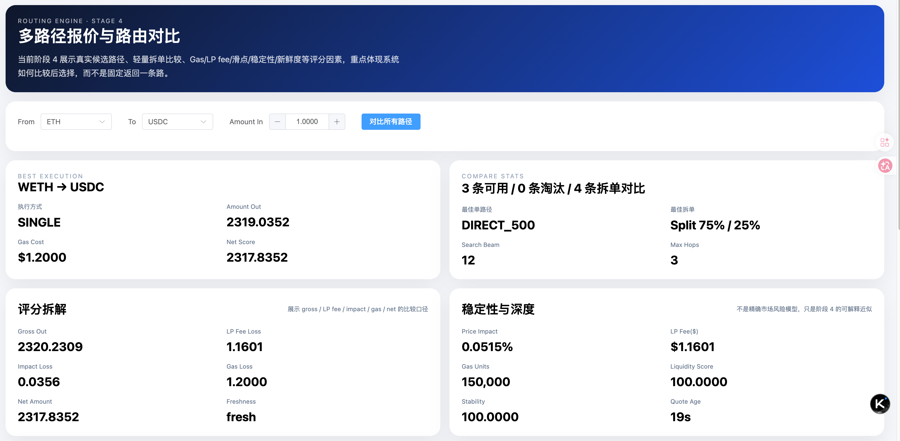
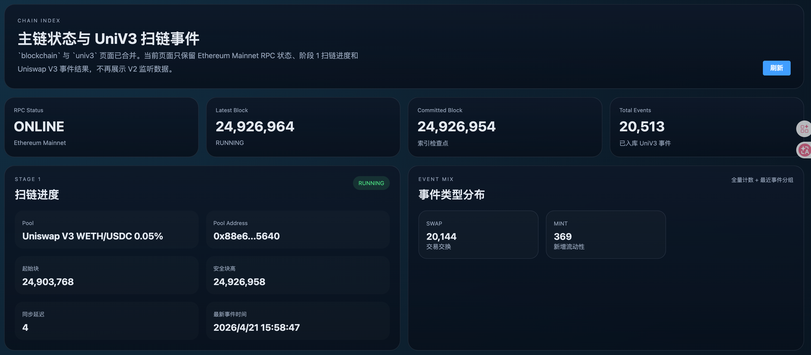
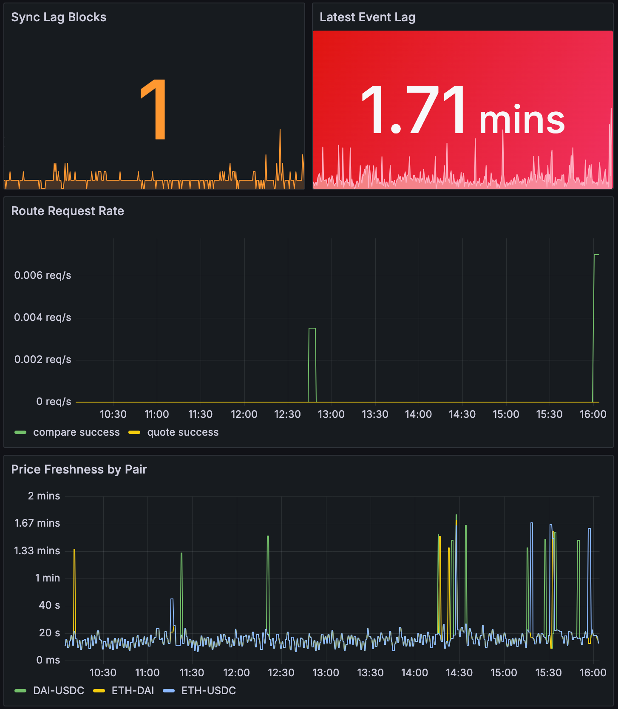

# DEX 聚合器后端练习项目

[](./README.md)
[](./README.zh-CN.md)

这是一个基于真实主网数据的 DEX 后端练习项目。当前仓库已经完成 **阶段 0-5 的可运行闭环**：索引、派生数据、路由、实时运维和本地监控栈。

## 项目概览

- **链**：Ethereum Mainnet
- **协议**：Uniswap V3
- **当前覆盖交易对**：`ETH/USDC`、`ETH/DAI`、`DAI/USDC`
- **价格来源**：主网真实池状态
- **报价来源**：Uniswap V3 Quoter
- **前端**：Vue 3 验证控制台
- **后端**：Spring Boot 多模块服务
- **运维栈**：Prometheus、Grafana、Alertmanager、Thanos、MinIO

## 页面截图

| Dashboard | Route Demo | Monitor |
|---|---|---|
|  |  |  |

## 重点知识点

- **链上数据接入**：区块、日志、checkpoint、reorg window
- **协议标准化**：把 Uniswap V3 原始事件转成稳定的内部模型
- **服务层设计**：价格、流动性、统计、路由快照
- **报价与选路**：多候选扩展、剪枝、gas/slippage 感知排序、可解释选路
- **实时运维能力**：Kafka、SSE、回放、监控、告警、可观测性

## 当前阶段覆盖情况

### 已完成

- **阶段 0：工程底座**
  - Maven 多模块结构
  - Docker Compose 基础依赖
  - 健康检查
  - 初始化 SQL 与启动脚本
- **阶段 1：单链读链与原始同步**
  - Ethereum Mainnet 连接检查
  - 最新区块读取
  - 主网池状态读取
- **阶段 2：DEX 协议索引与标准化**
  - Uniswap V3 Pool 事件索引
  - checkpoint 与 reorg window
  - `block -> tx -> log` 的稳定入库顺序
- **阶段 3：派生指标与数据服务**
  - 真实价格接口
  - 流动性池接口
  - 统计概览接口
  - 移除伪造 volume
- **阶段 4：报价与路由引擎**
  - route quote / compare API
  - 分层 beam-search 候选扩展
  - gas、fee、price impact、freshness、split route 比较
- **阶段 5：实时化与运维能力**
  - ops overview、SSE 价格推送、replay 入口
  - Prometheus 指标
  - Grafana 看板
  - Alertmanager 与 Thanos 本地监控拓扑

### 暂不纳入范围

- 多链支持
- 多协议插件化
- 历史回测导出
- 真正生产级高可用部署
- 实盘 MEV 执行

## 知识点地图

| 方向 | 在项目中的体现 |
|---|---|
| 区块链后端基础 | 区块扫描、RPC 接入、事件索引 |
| 数据建模 | pool / event 标准化模型、serving snapshot |
| 搜索与排序 | route candidate 生成、剪枝、评分 |
| 实时系统 | Kafka、SSE、定时刷新、replay |
| 后端工程化 | 缓存、接口分层、测试、回放安全 |
| 可观测性 | 指标、告警、看板、长期指标查询拓扑 |

## 仓库结构

```text
supedata/
├── dex-api/                 # REST 控制器、actuator、ops 接口
├── dex-business/            # 路由、价格、统计、领域服务
├── dex-common/              # 公共模型与工具
├── dex-data/                # 数据访问层
├── dex-infrastructure/      # 链接入、调度、监控、Kafka
├── dex-frontend/            # Vue 验证控制台
├── monitoring/              # Prometheus / Grafana / Thanos / Alertmanager 配置
├── sql/                     # SQL 初始化脚本
├── docker-compose.yml
├── init-db.sql
└── dex-aggregator-architecture.md
```

## 前端页面

- **Dashboard**
  - 统计概览、阶段摘要、指标边界说明、阶段 3 K 线
- **Route Demo**
  - 候选路径比较、评分拆解、拆单比较、淘汰原因
- **Monitor**
  - 实时运维总览、SSE 快照、回放记录、监控入口

## 快速启动

### 1. 启动基础设施

```bash
docker compose up -d
```

### 2. 如有需要，初始化 Uniswap V3 表结构

```bash
docker exec -i dex-mysql mysql -uroot -proot dex_db < sql/univ3_indexer_init.sql
```

### 3. 启动后端

```bash
/Applications/IntelliJ\ IDEA.app/Contents/plugins/maven/lib/maven3/bin/mvn -pl dex-api spring-boot:run
```

### 4. 启动前端

```bash
cd dex-frontend
npm install
npm run dev -- --host 127.0.0.1 --port 5173
```

## 核心接口

### 数据接口

- `GET /actuator/health`
- `GET /api/v1/prices`
- `GET /api/v1/liquidity/pools`
- `GET /api/v1/statistics/overview`

### 路由接口

- `GET /api/v1/routes/quote?from=ETH&to=USDC&amountIn=1`
- `GET /api/v1/routes/compare?from=ETH&to=USDC&amountIn=1`

### 运维接口

- `GET /api/v1/ops/overview`
- `GET /api/v1/ops/stream/prices`
- `POST /api/v1/ops/replay?fromBlock=...`

### 监控入口

- `GET /actuator/prometheus`
- Prometheus UI：`http://localhost:9090`
- Grafana：`http://localhost:3000`
- Alertmanager：`http://localhost:9093`
- Thanos Query：`http://localhost:10903`
- MinIO Console：`http://localhost:9001`

## 监控栈说明

当前监控方案是一个 **本地单机的生产式拓扑**：

- **Spring Boot**
  - 通过 `/actuator/prometheus` 暴露指标
- **Prometheus**
  - 抓取应用指标
  - 计算告警规则
  - 保存本地短中期 TSDB 数据
- **Alertmanager**
  - 聚合、静默、路由告警
- **Thanos Sidecar / Store / Query / Compactor**
  - 提供统一查询入口与长期指标架构
- **MinIO**
  - 作为 Thanos 的本地 S3 兼容对象存储
- **Grafana**
  - 展示 Prometheus / Thanos 数据，并提供 dashboard / Explore

它不是严格意义上的高可用生产集群，而是为了把“指标生产、采集、告警、长期存储、可视化”这些职责边界拆清楚。

## 设计文档

- 分阶段主设计文档：
  - [dex-aggregator-architecture.md](./dex-aggregator-architecture.md)
- MEV / 套利系统草图：
  - [docs/mev-arbitrage-architecture.md](./docs/mev-arbitrage-architecture.md)

## 实际说明

- 当前范围是**少量真实交易对 + 真实主网数据**，不是全量聚合器
- 真实池状态和报价带有短 TTL 缓存，用于降低 RPC 压力
- `volume` 明确不输出伪值
- Prometheus 通过 Docker 中的 `http://host.docker.internal:8080/actuator/prometheus` 抓取后端指标
