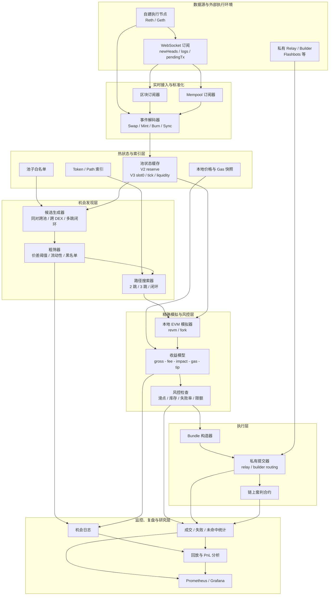

# MEV / 套利系统架构图

这是一版偏工程落地的 `MEV / DEX 套利系统` 架构图，主线以：

- 原子套利
- Backrun 搜索

为主，不包含 sandwich。

## 架构图

## 阅读顺序

建议按下面顺序理解：

1. 从上往下看主链路：
   `数据源 -> 接入 -> 热状态 -> 搜索 -> 模拟 -> 执行`
2. 再看最底部的 `监控、复盘与研究层`
3. 最后再回头看两条侧向支撑关系：
   - `私有 Relay / Builder -> 执行层`
   - `热状态 / Gas 快照 -> 搜索与模拟`

## 核心数据流

1. 节点实时推送区块、日志和 pending 交易。
2. 接入层把原始事件标准化后，持续刷新热池状态。
3. 搜索层只在白名单池子和预建索引上生成候选机会。
4. 模拟层在接近目标区块状态的上下文里重放路径，计算真实净收益。
5. 只有通过收益阈值和风控阈值的候选机会才进入执行层。
6. 执行层通过私有 relay / builder 提交 bundle，避免公开 mempool 暴露。
7. 全流程写入日志、统计、回放与 PnL 分析，支撑后续调参与风控。

## 设计调整说明

- 主链路改为纵向分层，避免原图从左到右过长，在 Markdown 预览里更容易被压扁。
- 每一层内部统一用横向排布，让节点宽高比例更接近，减少某一列过高、某一列过窄的问题。
- 把 `监控、复盘与研究` 单独放到底部，避免它与交易主链混成同一条业务路径。
- 把 `私有 Relay / Builder` 视为外部执行环境，而不是内部处理步骤，关系更准确。
